# Architecture Diagram

> **Rule:** This diagram is the single authoritative map of how codeupipe's
> components connect. Only add nodes and edges that have been explicitly
> specified by the project owner. Do not infer, guess, or auto-generate
> connections. If it isn't on the diagram, it isn't documented here yet.

```mermaid
graph TB
    %% ── Core ──────────────────────────────────────────────
    Core["codeupipe.core\nPayload · Filter · Pipeline\nValve · Tap · Hook · State\nStreamFilter · Govern · Secure"]

    %% ── Packages that depend on Core ──────────────────────
    Utils["codeupipe.utils\nRetryFilter\nErrorHandlingMixin"]
    Registry["codeupipe.registry\nRegistry · cup_component"]
    Testing["codeupipe.testing\nrun_filter · assert_payload\nmock_filter · run_pipeline"]
    Observe["codeupipe.observe\nCaptureTap · MetricsTap\nInsightTap · PushTap"]
    Runtime["codeupipe.runtime\nTapSwitch · HotSwap\nPipelineAccessor"]
    Graph["codeupipe.graph\npipeline_to_mermaid"]
    Converter["codeupipe.converter\nload_config\nbuild_export_pipeline\nbuild_import_pipeline"]

    Core --> Utils
    Core --> Registry
    Core --> Testing
    Core --> Observe
    Core --> Runtime
    Core --> Graph
    Core --> Converter

    %% ── Distribute ────────────────────────────────────────
    Distribute["codeupipe.distribute\nRemoteFilter · Checkpoint\nIterableSource · FileSource\nWorkerPool"]
    Core --> Distribute

    %% ── Deploy ────────────────────────────────────────────
    Deploy["codeupipe.deploy\n12 Adapters · Recipes · Init\n25 Platform Contracts\nObfuscate Pipeline"]
    Core --> Deploy

    %% ── Auth ──────────────────────────────────────────────
    Auth["codeupipe.auth\nGoogleOAuth · GitHubOAuth\nTokenVault · VaultHook\nCredentialStore"]
    Core --> Auth

    %% ── Linter ────────────────────────────────────────────
    Linter["codeupipe.linter\nlint · coverage · report\ndoc-check · agent-docs\n(dogfooded pipelines)"]
    Core --> Linter

    %% ── Connect ───────────────────────────────────────────
    Connect["codeupipe.connect\nConnectorConfig · HttpConnector\nLocalBridge · BridgeLauncher\ndiscover_connectors"]
    Core --> Connect

    %% ── Browser ───────────────────────────────────────────
    Browser["codeupipe.browser\nBrowserBridge · PlaywrightBridge\n10 Browser Filters"]
    Core --> Browser

    %% ── AI ────────────────────────────────────────────────
    AI["codeupipe.ai\nAgent SDK · Providers\nDiscovery · Hub · TUI · Eval\n(optional extras)"]
    Core --> AI

    %% ── Marketplace ───────────────────────────────────────
    Marketplace["codeupipe.marketplace\nfetch_index · search · info"]
    Core --> Marketplace

    %% ── CLI ───────────────────────────────────────────────
    CLI["codeupipe.cli\n32+ cup commands"]
    Core --> CLI
    CLI --> Linter
    CLI --> Deploy
    CLI --> Connect
    CLI --> Marketplace
    CLI --> Browser
    CLI --> AI
    CLI --> Auth

    %% ── Extension (Connect Platform) ─────────────────────
    Extension["Browser Extension\nMV3 · service-worker.js\ncontent-script.js\n5 recipes"]
    Connect --> Extension

    NativeHost["Native Messaging Host\nnative_host.py\n12 CUP Filters"]
    Connect --> NativeHost
    Extension --> NativeHost

    PlatformSPA["Platform SPA\nDashboard · Store\nInstall · Products"]
    Extension --> PlatformSPA

    %% ── Android Module ─────────────────────────────────────
    Android["codeupipe.android\nAdbBridge · EmulatorManager\n10 Android Filters"]
    Core --> Android

    %% ── Device Mesh ───────────────────────────────────────
    Mobile["Mobile Device\n(AdbBridge · IosBridge 🔜)"]
    Desktop["Desktop Compute\nDB · GPU · Files"]
    Servers["Servers\nAPIs · Services"]

    Android --> Mobile
    PlatformSPA -.- Mobile
    NativeHost --> Desktop
    Desktop --> Servers
    Distribute --> Servers

    %% ── External Connectors ──────────────────────────────
    ConnGoogleAI["codeupipe-google-ai\n4 filters"]
    ConnStripe["codeupipe-stripe\n4 filters"]
    ConnPostgres["codeupipe-postgres\n4 filters"]
    ConnResend["codeupipe-resend\n2 filters"]

    Connect --> ConnGoogleAI
    Connect --> ConnStripe
    Connect --> ConnPostgres
    Connect --> ConnResend

    %% ── Polyglot Ports ────────────────────────────────────
    PortTS["ports/ts\n@codeupipe/core\n88 tests"]
    PortRS["ports/rs\ncodeupipe-core\n59 tests"]
    PortGo["ports/go\ncodeupipe-core\n68 tests"]

    Core -.-|"same API"| PortTS
    Core -.-|"same API"| PortRS
    Core -.-|"same API"| PortGo

    %% ── MkDocs / Docs ────────────────────────────────────
    Docs["MkDocs Site\nsync_docs · copy_raw\nbuild_platform hooks"]
    Linter --> Docs
    PlatformSPA --> Docs

    %% ── Styles ────────────────────────────────────────────
    classDef core fill:#7c4dff,stroke:#333,color:#fff
    classDef pkg fill:#1e1e2e,stroke:#7c4dff,color:#cdd6f4
    classDef ext fill:#1e1e2e,stroke:#f9e64f,color:#cdd6f4
    classDef device fill:#1e1e2e,stroke:#89b4fa,color:#cdd6f4,stroke-dasharray:5
    classDef port fill:#1e1e2e,stroke:#a6e3a1,color:#cdd6f4,stroke-dasharray:5
    classDef connector fill:#1e1e2e,stroke:#fab387,color:#cdd6f4
    classDef docs fill:#1e1e2e,stroke:#cba6f7,color:#cdd6f4

    class Core core
    class Utils,Registry,Testing,Observe,Runtime,Graph,Converter,Distribute,Deploy,Auth,Linter,Connect,Browser,Android,AI,Marketplace,CLI pkg
    class Extension,NativeHost,PlatformSPA ext
    class Mobile,Desktop,Servers device
    class PortTS,PortRS,PortGo port
    class ConnGoogleAI,ConnStripe,ConnPostgres,ConnResend connector
    class Docs docs
```

**Legend**

| Style | Meaning |
|---|---|
| **Purple fill** | Core — the foundation everything depends on |
| **Purple border** | Internal packages — Python modules inside `codeupipe/` |
| **Yellow border** | Extension platform — browser extension, native host, SPA |
| **Blue dashed border** | Device endpoints — desktop, servers, mobile (IosBridge planned) |
| **Green dashed border** | Polyglot ports — same API in TS, Rust, Go |
| **Orange border** | External connectors — standalone PyPI packages |
| **Violet border** | Documentation — MkDocs site and build hooks |
| **Solid arrow (→)** | Direct dependency / data flow |
| **Dashed line (-·-)** | Logical relationship (same API, planned connection) |
